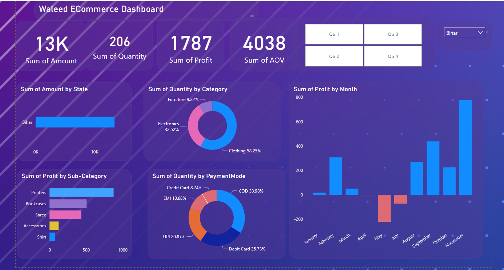

# E-Commerce Sales Dashboard in Power BI

This project involves the development of an interactive E-Commerce Sales Dashboard using Power BI. The dashboard provides comprehensive insights into sales performance, focusing on key metrics such as profit, product categories, and sub-categories.

## Data Sources

The dashboard leverages data from two primary CSV files:

* **Details.csv**: This file contains detailed information about each order, including `Order ID`, `Amount`, `Profit`, `Quantity`, `Category`, `Sub-Category`, and `PaymentMode`.
* **Orders.csv**: This file provides general order information such as `Order ID`, `Order Date`, `CustomerName`, `State`, and `City`.

## Dashboard Focus

The primary areas of focus for this dashboard are:

* **Profit Analysis**: Gain insights into the profitability of sales.
* **Category Performance**: Understand the performance of different product categories.
* **Sub-Category Breakdown**: Delve deeper into the performance of specific sub-categories within each product category.

## Visual Representation

